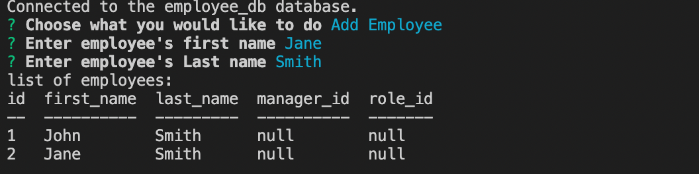

# employee-tracker
A command line interface designed using npm inquirer, console.table, mysql2, and dotenv. Allows a user to add an employee to a mysql database.

## Example Screenshots
### Main Menu:

### After adding an employee:
